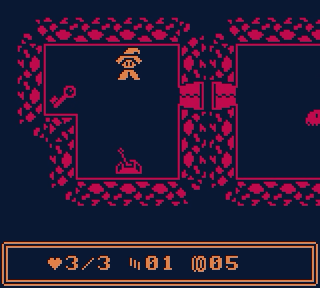
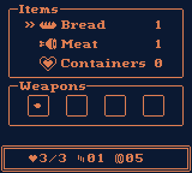

# Dusky Dungeon
Dusky Dungeon is a simple dungeon crawler for the Game Boy (Color) made with [GBStudio](https://www.gbstudio.dev/).

Play it for free on [itch.io](https://invertedhat.itch.io/dusky-dungeon).

### License
The GBStudio project is licensed under the MIT license. 
The graphics are licensed under the [CC BY](https://creativecommons.org/licenses/by/4.0/) license.

### Credits
**Fonts** 
[Gothic Pixel Font](https://dacosta.itch.io/gothic-pixel-font) by Dacosta 
[Romulus](https://opengameart.org/content/pixel-fonts-by-pix3m) by Pix3M (slightly adapted width of some characters to fit with GBStudio) 

**Music** 
Title & Game Over Screen: Monty's Overheating Spaceship by krümel 
Choose Level: Short Hauntings by DeerTears 
Level: Darkstone Remix by Tronimal (Original by DeerTears) 
Dragon Boss: Boss Fight 1 by krümel

All music is from the [GB-Studio-Community-Assets](https://github.com/DeerTears/GB-Studio-Community-Assets) project.
